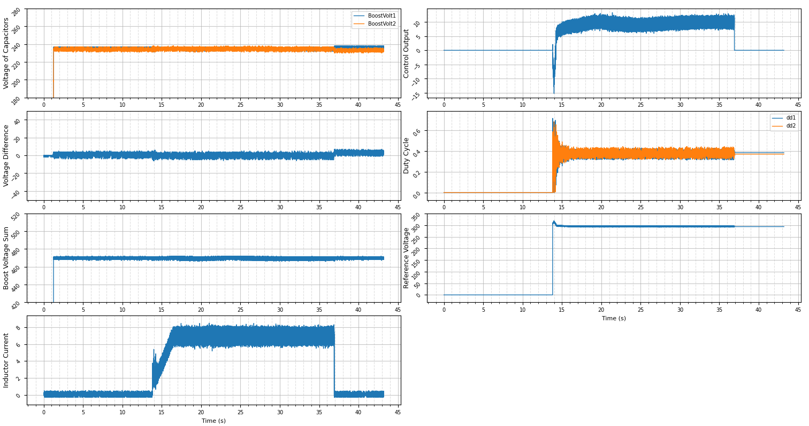

# Data Processing and Visualization Project

本项目用于处理原始 `.dat` 格式的数据文件，自动完成数据解析、清洗、存储，并支持可视化绘制。  
项目支持通过 **YAML 配置文件** 定义数据列和处理规则，具有良好的可扩展性和灵活性。  

---

## ✨ 功能特性

- **数据读取**：自动从 `data/raw` 中读取最新的原始 `.dat` 文件。  
- **数据清洗**：支持根据配置过滤无效值、异常值。  
- **数据存储**：处理后的数据自动保存到 `data/processed` 文件夹。  
- **可视化绘制**：支持多列数据波形的绘制。  
- **配置化管理**：通过 `config/data_config.yml` 灵活定义列名、忽略值、新增计算列。  
- **命令行参数**：支持从命令行指定输入/输出路径。  

---

## 📂 项目结构
```
├── main.py # 主入口，运行程序
├── requirements.txt # 项目依赖
├── README.md # 使用文档
├── config/
│ └── data_config.yml # 数据列与处理规则配置文件
├── data/
│ ├── raw/ # 存放原始 .dat 数据文件
│ └── processed/ # 存放处理后的 .csv 文件
└── src/
  ├── data_processor.py # 数据读取与清洗逻辑
  ├── data_plotter.py # 数据可视化逻辑
  ├── config_manager.py # 配置文件解析与管理
  └── init.py
```
---

## 🛠️ 环境安装

### 1. 克隆项目
```bash
git clone https://github.com/CCandle/PV_data_process.git
cd PV_data_process
```

### 2. 安装依赖
```bash
pip install -r requirements.txt
```
（推荐使用 conda 或 venv 创建虚拟环境）

---

## ⚙️ 配置文件说明
配置文件位于 config/data_config.yml，用于定义数据列及规则。
示例：
```yml
channels_config:
  - source: BoostVolt1
  - source: BoostVolt2
  - source: BoostCurr1(A)
    transform: "lambda x: x * 0.01"
    filter_vals: [327.67, 204.79]
  - source: Vbalance.Uref(V)
    transform: "lambda x: x * 0.01"
  - source: Iboost_PICtl.Out
    transform: "lambda x: x * 0.01"
  - source: dd1
    transform: "lambda x: x * 0.001"
  - source: dd2
    transform: "lambda x: 1 - x * 0.001"
  - source: InvFault
  - source: d
    transform: "lambda x: x * 0.001"
  - source: delta_D
    transform: "lambda x: x * 0.001"
  - source: "100"
  - source: "500"
  - source: igbtTemp
  - source: "7000"
  - source:
      expression: "BoostVolt1 - BoostVolt2"
      name: BoostVolt_diff
  - source:
      expression: "BoostVolt1 + BoostVolt2"
      name: BoostVolt_sum

draw_config:
  column_groups:
    - title: "Voltage of Capacitors"
      columns: ["BoostVolt1", "BoostVolt2"]
      yaxis: [180, 280]
    - title: "Voltage Difference"
      columns: ["BoostVolt_diff"]
      yaxis: [-50, 50]
    - title: "Boost Voltage Sum"
      columns: ["BoostVolt_sum"]
      yaxis: [420, 520]
    - title: "Inductor Current"
      columns: ["BoostCurr1(A)"]
    - title: "Control Output"
      columns: ["Iboost_PICtl.Out"]
    - title: "Duty Cycle"
      columns: ["dd1", "dd2"]
    - title: "Reference Voltage"
      columns: ["Vbalance.Uref(V)"]
  cols_per_row: 2
  start_time: 0
  end_time: 100
  xaxis_interval: auto 

settings:
  fs: 20000.0
  header: 0x7EEE
  tail: 0x7FFF
```
+ channels_config：定义原始列、数据变换、忽略值或表达式计算。
+ draw_config：配置绘图的分组、标题、坐标轴范围。
+ settings：定义采样频率及数据帧格式。

---

## 🚀 使用方法
运行主程序
默认会读取 `data/raw` 中最新的 `.dat` 文件，并输出到 `data/processed`：
```bash
python main.py
```
指定输入文件和配置文件
```bash
python main.py data/raw/sample.dat config/data_config.yml
```

---

## 📊 输出说明
+ 处理后数据：以 CSV 格式保存到 `data/processed/`
+ 可视化图像：运行时会弹出波形图窗口，绘制配置中指定的列。

---

## 📖 示例
输入文件：`data/raw/sample.dat`
运行：
```bash
python main.py data/raw/sample.dat config/data_config.yml
```
输出：
+ 清洗后的数据保存为：
`sample.csv`
+ 终端打印：
```bash
未指定输入文件，默认使用最新文件: data/raw/sample.dat
已加载配置文件: config/data_config.yml
原始数据点数: 13824000, 总帧数: 864000
帧头帧尾筛选: 864000 -> 864000 帧
时间范围筛选: 864000 -> 864000 帧
异常值过滤: 864000 -> 863668 行
已保存到 data/processed/sample.csv, 最终数据点数: 863668
可用数据列:
  - Time(s)
  - BoostVolt1
  - BoostVolt2
  - BoostCurr1(A)
  - Vbalance.Uref(V)
  - Iboost_PICtl.Out
  - dd1
  - dd2
  - InvFault
  - d
  - delta_D
  - 100
  - 500
  - igbtTemp
  - 7000
  - BoostVolt_diff
  - BoostVolt_sum
```

输出波形 

---

## 🤝 贡献指南
欢迎提交 Issue 和 Pull Request！
建议遵循以下流程：
+ Fork 本仓库
+ 创建功能分支 (`git checkout -b feature/your-feature`)
+ 提交修改 (`git commit -m 'Add some feature'`)
+ 推送分支 (g`it push origin feature/your-feature`)
+ 提交 Pull Request

---

## 📜 许可证

本项目使用 MIT License，详情见 [LICENSE](LICENSE)。

---

## 👨‍💻 作者
开发者: [CCandle](https://github.com/CCandle)

联系方式: 2987794676@qq.com